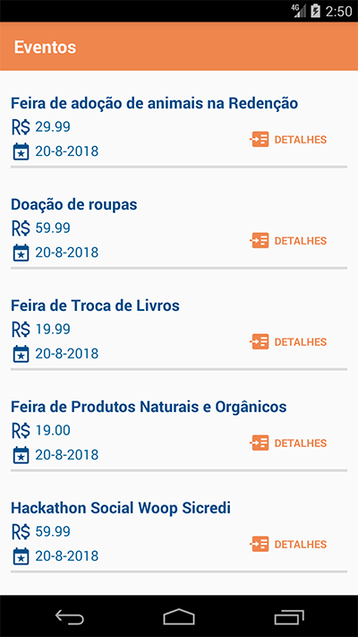
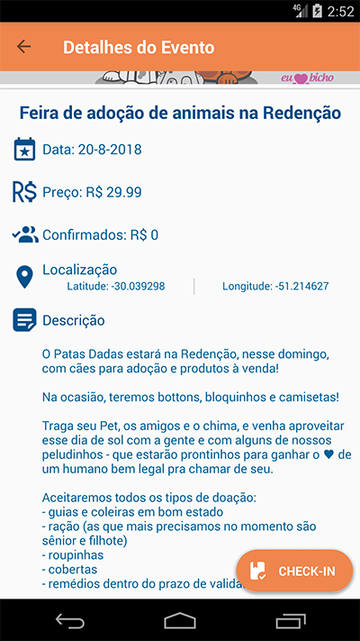
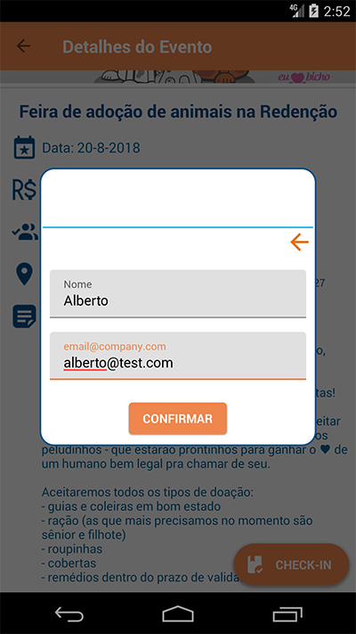
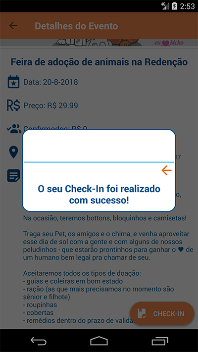

# Event App

Creating a App to list and study.

# Overview

* Arquitetura utilizada foi `MVVM`, sendo ela a recomendada pela Google, pois permite uma melhor
  separação de responsabilidades das peças do projeto, dividindo ele em:

-
    - `Repositório` - responsável por buscar informações, localmente ou online.
-
    - `ViewModel` - lógica de negócio e tratamento de dados.
-
    - `View` - apresentação de informações para o usuário.

* Consumo da API, foram utilizadas algumas bibliotecas, o `Retrofit` junto com `OKHTTP` e `Gson`
  para conversão dos dados.

* Persistência dos dados:
-
  - Não houve, pois decidi que o app deveria atuar com os eventos em tempo real, já que existia a
    possibilidade de fazer Check-in, mas como opção de melhoria, seria a utilização do Room, para
    que fosse possível ver os eventos offline.

* Para exibir as imagens a partir de uma URL foi utilizada a biblioteca `Glide`.

* Apresentação de dados reativos utilizando `LiveData`.

* Injeção de dependências com o `Hilt`.

* Testes unitários com o `Mockk`.

# Images:

 

 

 

 

 

# API Rest:

* [API](https://5f5a8f24d44d640016169133.mockapi.io/api/events)

# Used libraries:

* [Hilt](https://developer.android.com/training/dependency-injection/hilt-android)
* [Retrofit](https://square.github.io/retrofit/)
* [OkHttp](https://square.github.io/okhttp/)
* [Glide](https://bumptech.github.io/glide/)
* [Mockk](https://mockk.io/)
